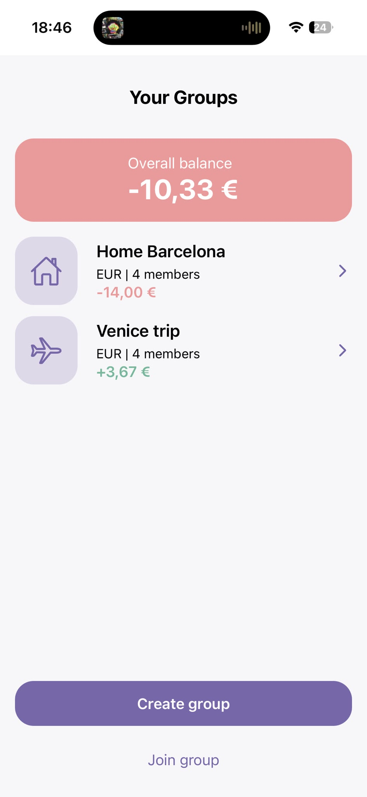
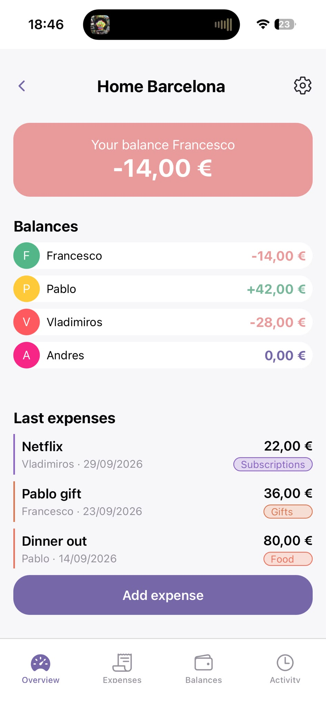
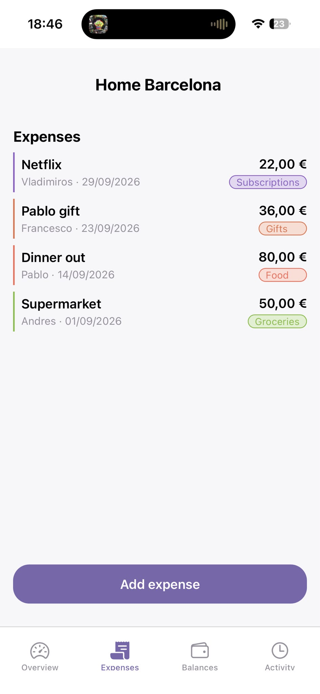
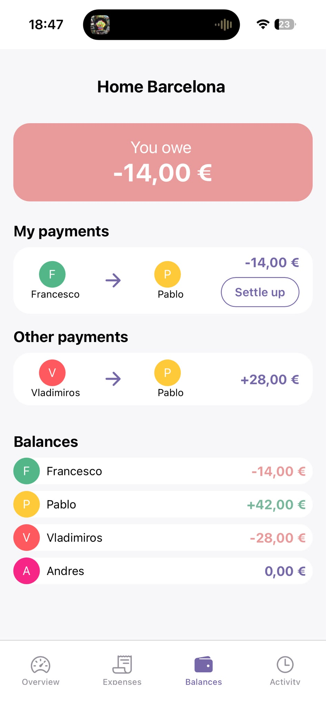
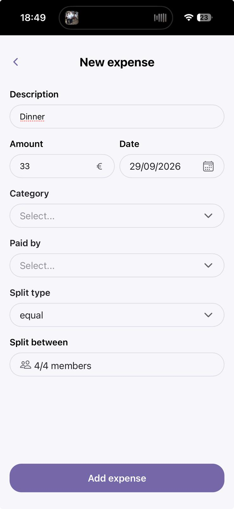
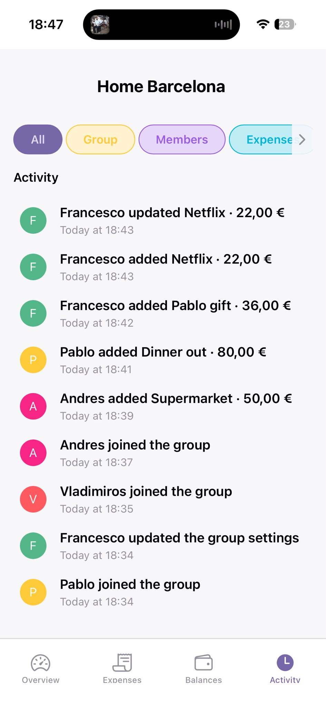
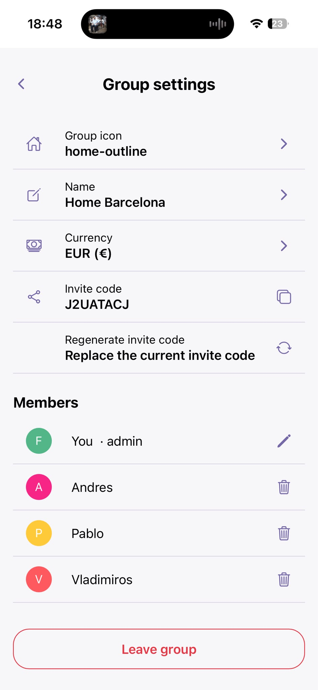

# Splitly - Share expenses with your group

## DESCRIPTION
Splitly is an app for managing shared expenses with friends, roommates, or groups. 
Users can create or join multiple groups, add shared expenses, track balances, and settle up without registration or a traditional account.

## DEMO
- WebApp: https://splitly-f.onrender.com
- Android APK: available in this repository

## SCREENSHOTS

  
  
  
  

  
  
  

## FEATURES
- Create and join groups (with an invite code)
- Add and split shared expenses
- Track balances between group members
- Settle up payments
- Activity history
- No registration required
- Persistent member identity across groups

## TECH STACK
### Frontend:
- Javascript
- React Native
- Expo
- Expo router
- PWA

### Backend:
- Node.js
- Express
- REST API
- JavaScript

### Database:
- Supabase
- PostgreSQL

### Deployment:
- Render
- Expo Application Services (EAS)
- GitHub

